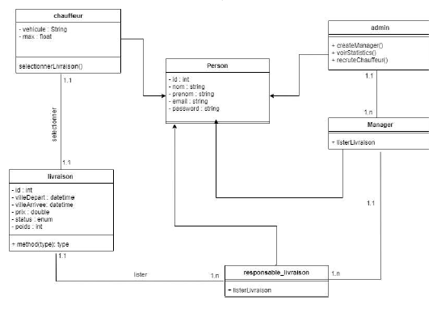

# MarocShip

## Conception

## Contexte du projet   

Dans le cadre de son développement au Maroc, la société MarocShip souhaite faciliter la gestion de livraison avec les sites E-commerce partenaires par la création d’une application web
la société MarocShip est une société multinationale basée à Casablanca et dérigée par un seul Admin( il va créer les managers), chaque année MarocShip recrute plusieurs chauffeurs pour couvrir la forte demande des livraisons, chaque chauffeur est responsable d'un véhicule qui peut être une voiture ou petit camion ou grand camion voir les avions pour les livraison internationales.
Chaque responsable de livraison crée par un Manager va affecter une livraison à chaque chauffeur comme suit:
Les livraisons par voiture seulement pour les commandes qui ne dépassent pas 200kg
Les livraisons par petit camion seulement pour les commandes qui ne dépassent pas 800kg
Les livraisons par grand camion seulement pour les commandes qui ne dépassent pas 1600kg
Les livraisons internationales se réalisent par avion
Une fois la livraison est remplie, tous les chauffeurs concernés vont recevoir un email qui va contenir tous les détails de livraison
Quand un chauffeur sélectionne une livraison , cette dernière ne doit pas être affichée chez les autres chauffeurs
par exemple:
une livraison de 140kg va être faite par voiture le 14/03/2022 de la ville de Safi vers la ville d'Agadir: Chauffeur Ali Ahmed
Chaque livraison réalisée est enregistrée dans le système
Tous les chauffeurs (Voiture, petit Camion et Camion) vont recevoir une prime comme suit::
1000 KM par mois vont recevoir 15% du montant global de la livraison
2000Km par mois vont recevoir 22% du montant global de la livraison
2500Km par mois vont recevoir 30% du montant global de la livraison

le montant de chaque livraison est calculé par 1kg
chaque 1kg=40dhs
si la livraison dépasse 3 Kg chaque Kg de plus sera égale à 5dhs
pour les livraison internationales le tarif sera comme suit:
la zone Europe: 1kg=160DHS
la zone Amérique 1kg=220 dhs
la zone Asie: 1kg=240dhs
la zone Australie 1kg= 260dhs
les tarifs seront convertible en devise de chaque zone
Chaque Manager va consulter les statistiques des meilleurs chauffeurs et le classement de livraison

## Travail Demandé

Le cahier des charges de l'application
Le diagramme de classe adéquat au cahier des charges
Fichier de Gestion Trello/Jira
Développement de la partie partie backend en Java/Hibernate/JPA
Développement de la partie FrontEnd Jsf
Créez les images Docker nécessaires  pour démarrer le projet dans un environnement Java/ MySql/PhpmyAdmin

Appliquez Les Principes SOLID dans votre Projet MarocShip

Bonus:
La société MarocShip souhaite via l'interface de Manager consulter tous les tragets(itinéraire) de tous les chauffeurs sur une Map comme Google ou bing
